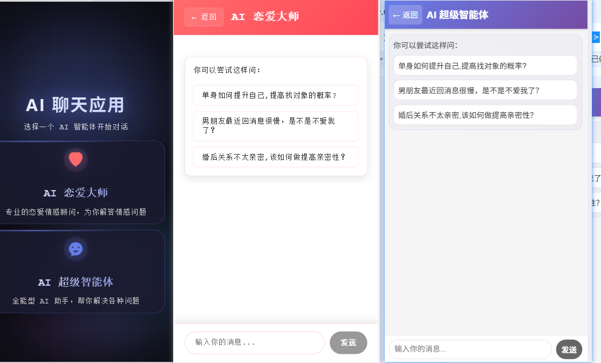
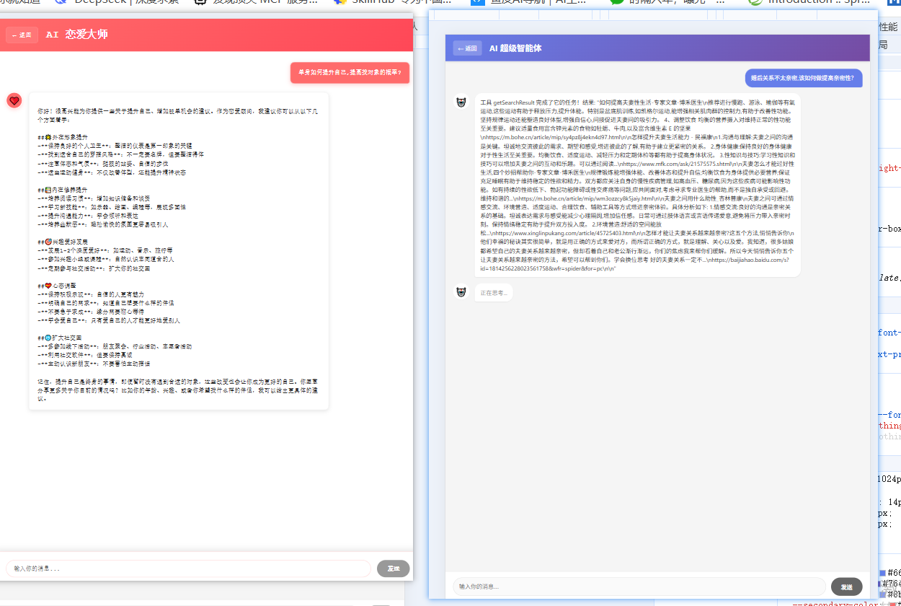

# Adventure AI Agent 🤖

> 基于 Spring AI 构建的多模型 AI 智能体应用，集成千问（DashScope）与智谱（ZhiPuAI）双大模型，实现多轮对话、文件持久化记忆、工具调用、MCP 服务集成、RAG 知识库检索及 ReAct 模式的自主智能体。
> 访问地址：https://ai-agent-front-255905-7-1367314297.sh.run.tcloudbase.com/manus-app
>
> 
>
> 

---

## 📋 目录

- [项目概述](#项目概述)
- [技术栈](#技术栈)
- [系统架构](#系统架构)
- [快速开始](#快速开始)
- [大模型接入](#大模型接入)
- [多轮对话与记忆](#多轮对话与记忆)
- [工具调用系统](#工具调用系统)
- [ReAct 智能体](#react-智能体)
- [RAG 知识库](#rag-知识库)
- [MCP 服务集成](#mcp-服务集成)
- [API 接口文档](#api-接口文档)
- [项目结构](#项目结构)
- [配置文件说明](#配置文件说明)
- [开发指南](#开发指南)
- [测试](#测试)

---

## 项目概述

Adventure AI Agent 是一个基于 **Spring Boot 3.5** + **Spring AI 1.x** 的全栈 AI 应用，提供了一个完整的智能体框架，主要功能包括：

| 功能模块 | 说明 |
|---------|------|
| 🧠 **双模型集成** | 同时接入通义千问（DashScope）和智谱 AI（GLM）双大模型 |
| 💬 **多轮对话** | 支持基于会话 ID（chatId）的多轮对话上下文管理 |
| 💾 **对话记忆** | 同时支持内存（In-Memory）和文件（Kryo 序列化）两种持久化方案 |
| 🔧 **工具调用** | 8 个内置工具：日期查询、搜索、PDF生成、文件读写、网页抓取、资源下载等 |
| 🤖 **ReAct 智能体** | 四层继承架构：BaseAgent → ReActAgent → ToolCallAgent → AdventureManus |
| 📚 **RAG 知识库** | 基于本地向量库（SimpleVectorStore）的文档检索增强生成 |
| 🗺️ **MCP 服务** | 集成高德地图 MCP 服务配置 |
| 📄 **PDF 生成** | 基于 iText 的中文 PDF 生成，支持自定义字体与降级方案 |
| 🔍 **联网搜索** | 基于 searchapi.io 的百度搜索引擎集成 |
| 🌐 **网页抓取** | 基于 Jsoup 的网页内容抓取工具 |

---

## 技术栈

### 核心框架

| 技术 | 版本 | 用途 |
|------|------|------|
| Spring Boot | 3.5.10 | 应用框架 |
| Spring AI | 1.1.x | AI 模型统一接入抽象层 |
| Java | 21 | 运行时 |
| Maven | 3.x | 构建工具 |

### 大模型与 AI

| 依赖 | 版本 | 说明 |
|------|------|------|
| `spring-ai-starter-model-zhipuai` | 1.1.2 | 智谱 AI 大模型接入 |
| `spring-ai-alibaba-starter-dashscope` | 1.1.0.0 | 阿里通义千问 DashScope 接入 |
| `dashscope-sdk-java` | 2.22.4 | DashScope 原生 SDK |
| `spring-ai-alibaba-agent-framework` | 1.1.0.0 | 阿里 Agent 框架（ToolCallingManager） |

### 向量存储 & RAG

| 依赖 | 版本 | 说明 |
|------|------|------|
| `spring-ai-pgvector-store` | 1.1.1 | PostgreSQL PGVector 向量存储 |
| `spring-ai-advisors-vector-store` | 1.1.2 | RAG Advisor 组件 |
| `spring-ai-markdown-document-reader` | 1.1.0 | Markdown 文档解析器 |

### 工具库

| 依赖 | 版本 | 说明 |
|------|------|------|
| `hutool-all` | 5.8.43 | 综合工具库（HTTP、文件、JSON） |
| `kryo` | 5.6.2 | Java 序列化框架（对话持久化） |
| `jsoup` | 1.19.1 | HTML 解析/网页抓取 |
| `itext-core` | 9.1.0 | PDF 生成 |
| `jackson` | 2.18.2 | JSON 序列化 |
| `knife4j` | 4.4.0 | API 文档生成 |

---

## 系统架构

### 整体架构图

```
┌──────────────────────────────────────────────────────────┐
│                     Client / Frontend                     │
└──────────────────┬───────────────────────────────────────┘
                   │ HTTP / SSE
┌──────────────────▼───────────────────────────────────────┐
│                    Controller Layer                        │
│  ┌─────────────┐  ┌────────────────────────────────┐      │
│  │ MainController│  │       AiController             │      │
│  │  /health     │  │  /love_app/chat/*  /manus/chat │      │
│  └─────────────┘  └────────┬───────────────────────┘      │
└─────────────────────────────┬─────────────────────────────┘
                              │
┌─────────────────────────────▼─────────────────────────────┐
│                     Service Layer                          │
│  ┌─────────────────┐  ┌───────────────────────────────┐   │
│  │  LoveApp         │  │    ReAct Agent 体系           │   │
│  │  (恋爱顾问应用)   │  │  ┌───────────┐               │   │
│  │  - 多轮对话       │  │  │ BaseAgent │               │   │
│  │  - 对话记忆       │  │  └─────┬─────┘               │   │
│  │  - 工具调用       │  │  ┌─────▼─────┐               │   │
│  │  - RAG 知识库     │  │  │ReActAgent │               │   │
│  └─────────────────┘  │  └─────┬─────┘               │   │
│                        │  ┌─────▼───────┐             │   │
│                        │  │ToolCallAgent│             │   │
│                        │  └─────┬───────┘             │   │
│                        │  ┌─────▼─────────┐           │   │
│                        │  │AdventureManus │           │   │
│                        │  └───────────────┘           │   │
│                        └───────────────────────────────┘  │
└───────────────────────────────────────────────────────────┘
                              │
        ┌─────────────────────┼─────────────────────┐
        │                     │                     │
┌───────▼──────┐  ┌──────────▼─────────┐  ┌───────▼────────┐
│  LLM 模型层   │  │   工具层            │  │  记忆/存储层    │
│              │  │                    │  │                │
│ 智谱 AI(GL M)│  │ DateTimeTools     │  │ 文件记忆(Kryo) │
│ 通义千问(Qwen)│  │ WeatherTools      │  │ 内存记忆        │
│ DashScope API│  │ FileOperationTool  │  │ SimpleVector   │
│              │  │ SearchApiTools     │  │ Store(本地RAG) │
│              │  │ PDFGenerationTool  │  │ PGVector Store │
│              │  │ ResourceDownload   │  │                │
│              │  │ WebScrapingTool    │  │ MCP服务(地图)  │
│              │  │ TerminateTool      │  │                │
└──────────────┘  └────────────────────┘  └────────────────┘
```

### 核心数据流

#### 恋爱顾问对话流
```
用户请求 → AiController → LoveApp.doChatWithMemory()
  → MessageChatMemoryAdvisor（注入记忆上下文）
  → ChatClient.prompt()（调用智谱 AI）
  → 工具调用（可选）
  → 返回响应 → 写入文件记忆
```

#### ReAct 智能体执行流
```
用户请求 → AiController → AdventureManus.runStream()
  → BaseAgent 初始化（状态 IDLE → RUNNING）
  → 循环执行 step()（最大 20 步）:
      ├─ ReActAgent.think()
      │   └─ LLM 决定是否调用工具
      │       ├─ 不调用 → 返回 false → step 结束
      │       └─ 调用工具 → 返回 true → 进入 act()
      └─ ReActAgent.act()
          └─ ToolCallingManager.executeToolCalls()
              └─ 检测 TerminateTool → 状态 FINISHED
  → SSE 流式推送每步执行结果
```

---

## 快速开始

### 环境要求

- JDK 21+
- Maven 3.8+
- PostgreSQL（可选，用于 PGVector 存储）
- 智谱 AI API Key（[智谱开放平台](https://open.bigmodel.cn/)）
- 通义千问 API Key（[阿里云百炼](https://bailian.aliyun.com/)）
- Search API Key（[searchapi.io](https://www.searchapi.io/)）

### 配置步骤

#### 1. 克隆项目

```bash
git clone https://github.com/your-username/adventure-ai-agent.git
cd adventure-ai-agent
```

#### 2. 配置环境变量

创建 `application-local.yml` 并配置以下内容（参考 `application.yml` 主配置）：

```yaml
spring:
  ai:
    zhipuai:
      api-key: your_zhipu_api_key
      chat:
        options:
          model: glm-4.5-air
    dashscope:
      api-key: your_dashscope_api_key
      chat:
        options:
          model: qwen-plus

search:
  api:
    key: your_searchapi_key
```

或者通过环境变量注入（推荐）：

```bash
export ZHIPUAI_API_KEY=your_zhipu_api_key
export ZHIPUAI_MODEL=glm-4.5-air
export DASH_SCOPE_API_KEY=your_dashscope_api_key
export SEARCH_API_KEY=your_searchapi_key
```

> **安全提示**：`application-local.yml` 和 `application-prod.yml` 提交到了 Git 仓库，建议添加至 `.gitignore` 或使用环境变量方式注入敏感信息。

#### 3. 配置 PDF 字体（可选）

默认字体路径可在 `application.yml` 中配置：

```yaml
pdf:
  font:
    path: "${PDF_FONT_PATH:C:/Windows/Fonts/MiSans-Regular.otf}"
    fallback: "C:/Windows/Fonts/msyh.ttc"
    encoding: "${PDF_FONT_ENCODING:Identity-H}"
```

支持环境变量 `PDF_FONT_PATH` 和 `PDF_FONT_ENCODING` 覆盖。

#### 4. 启动应用

```bash
# 使用 Maven 构建并启动
mvn spring-boot:run

# 或打包后运行
mvn clean package -DskipTests
java -jar target/adventure-ai-agent-0.0.1-SNAPSHOT.jar

# 使用 Maven Wrapper
./mvnw spring-boot:run
```

应用默认在 `http://localhost:8392/api` 启动。

#### 5. 验证健康检查

```bash
curl http://localhost:8392/api/health
# 返回: Hello World!
```

---

## 大模型接入

### 智谱 AI（ZhiPuAI）— 主模型

项目以智谱 AI 作为主要业务模型，通过成熟的 Spring AI 官方 Starter 集成。

**依赖**：`spring-ai-starter-model-zhipuai:1.1.2`

**配置**：
```yaml
spring:
  ai:
    zhipuai:
      api-key: ${ZHIPUAI_API_KEY}
      chat:
        options:
          model: ${ZHIPUAI_MODEL}  # 默认 glm-4.5-air
```

**注入方式**：
```java
@Autowired
@Qualifier("zhiPuAiChatModel")
private ChatModel zhiPuAiChatModel;
```

**使用场景**：
- 💬 `LoveApp` 恋爱顾问应用的交互模型
- 🤖 `AdventureManus` 智能体的底层推理模型
- 🔄 `QueryRewriter` 查询重写模型（RAG 预处理）
- 📊 `LoveAppLocalVectorStoreConfig` 文档向量化（Embedding）

### 通义千问（DashScope/Qwen）— 辅助模型

通过阿里 Cloud AI 提供的 DashScope Starter 接入，同时保留原生 SDK 的直接调用方式。

**依赖**：
- `spring-ai-alibaba-starter-dashscope:1.1.0.0` — Spring AI 统一接入
- `dashscope-sdk-java:2.22.4` — 原生 API 回调

**配置**：
```yaml
spring:
  ai:
    dashscope:
      api-key: ${DASH_SCOPE_API_KEY}
      chat:
        options:
          model: qwen-plus
```

**原生 SDK 调用示例**（`DashscopeTextGeneration.java`）：

通过 Hutool HTTP 客户端直接调用 DashScope RESTful API，适用于需要精细控制请求参数或不依赖 Spring AI 抽象层的场景：

```java
// 构建请求
HttpResponse response = HttpRequest.post("https://dashscope.aliyuncs.com/api/v1/services/aigc/text-generation/generation")
    .header("Authorization", "Bearer " + apiKey)
    .header("Content-Type", "application/json")
    .body(requestBody)
    .execute();
```

### 双模型切换机制

项目目前以 **智谱 AI** 为主模型，千问为辅。可通过 `@Qualifier` 注解灵活切换：

```java
// 使用智谱
@Qualifier("zhiPuAiChatModel") ChatModel chatModel

// 使用千问（当前 LoveApp 中已注释）
@Qualifier("dashScopeChatModel") ChatModel chatModel
```

---

## 多轮对话与记忆

### 基于内存的对话记忆

**配置类**：`LoveAppChatMemoryConfig.inMemoryChatMemory()`

```java
@Bean(name = "inMemoryChatMemory")
public ChatMemory inMemoryChatMemory() {
    ChatMemoryRepository repository = new InMemoryChatMemoryRepository();
    return MessageWindowChatMemory.builder()
            .chatMemoryRepository(repository)
            .maxMessages(10)
            .build();
}
```

- 使用 `InMemoryChatMemoryRepository` 作为存储后端
- 保留最近 **10 条**消息
- 应用重启后记忆丢失

### 基于文件的对话记忆（默认）

**核心类**：`FileBasedChatMemory` 实现了 Spring AI 的 `ChatMemory` 接口

**实现原理**：
- 使用 **Kryo** 高性能序列化框架将对话历史持久化到磁盘文件
- 每个会话对应一个 `.kryo` 文件，存储在 `{项目根目录}/tmp/chatMemory/{conversationId}.kryo`
- 使用 `StdInstantiatorStrategy` 实例化策略，确保兼容性
- 保留最近 10 条消息，超出的旧消息自动截断

**配置**：
```java
@Bean(name = "fileBasedChatMemory")
public ChatMemory fileBasedChatMemory() {
    return new FileBasedChatMemory(
        FileConstant.FILE_SAVE_DIR + "/chatMemory",
        10  // 保留最近 10 条消息
    );
}
```

**核心 API**：
```java
// 添加消息到会话
void add(String conversationId, List<Message> messages);

// 获取会话消息历史
List<Message> get(String conversationId);

// 清除指定会话的记忆
void clear(String conversationId);
```

### 记忆在对话中的应用

`LoveApp` 通过 `MessageChatMemoryAdvisor` 将对话记忆无缝注入到 ChatClient 调用中：

```java
// 无感集成：Advisor 自动注入历史上下文
Flux<String> content = chatClient.prompt()
        .user(message)
        .advisors(spec -> spec
            .param("conversationId", chatId)  // 会话标识
            .param(TOP_K, 10))                // 最近 N 条
        .stream()
        .content();
```

**关键设计**：
- 通过 `chatId` 参数区分不同会话
- 每次对话自动将历史和当前消息一并提交给 LLM
- 返回响应后自动保存到文件

---

## 工具调用系统

项目注册了 **8 个内置工具**，覆盖了信息获取、文件处理、内容生成等多个领域。

### 工具注册

在 `ToolRegistrationConfig` 中统一注册，通过 `ToolCallbacks.from()` 批量注册：

```java
@Configuration
public class ToolRegistrationConfig {

    @Bean
    public ToolCallback[] registerTools() {
        return ToolCallbacks.from(
            new DateTimeTools(),        // 日期时间
            new WeatherTools(),         // 天气查询
            new FileOperationTool(),    // 文件读写
            new SearchApiTools(apiKey), // 搜素引擎
            new PDFGenerationTool(...), // PDF 生成
            new ResourceDownloadTool(), // 资源下载
            new WebScrapingTool(),      // 网页抓取
            new TerminateTool()         // 终止交互
        );
    }
}
```

### 工具清单

| 工具类 | 方法 | 功能描述 | tool 注解描述 |
|--------|------|---------|-------------|
| **DateTimeTools** | `getCurrentDateTime()` | 获取当前日期时间（时区自适应） | `Get the current date and time in the user's timezone` |
| **WeatherTools** | `getWeather(city)` | 查询指定城市天气 | `查询当地的天气` ⚠️ 当前返回占位信息 |
| **FileOperationTool** | `readFile(fileName)` | 读取文件内容 | `Read content from a file` |
| | `writeFile(fileName, content)` | 写入文件内容 | `Write content to a file` |
| **SearchApiTools** | `getSearchResult(query)` | 百度搜索引擎搜索 | `Search for information from baidu search engine` |
| **PDFGenerationTool** | `generatePDF(fileName, content)` | 生成中文 PDF 文档 | `Generate PDF file with given content` |
| **ResourceDownloadTool** | `downloadResource(url, fileName)` | 从 URL 下载资源 | `Download a resource from a given URL` |
| **WebScrapingTool** | `scrapeWebPage(url)` | 抓取网页 HTML 内容 | `Scrape the content of a web page` |
| **TerminateTool** | `doTerminate()` | 终止智能体交互循环 | `Terminate the interaction when the request is met` |

### 工具详细说明

#### 1. DateTimeTools
- 基于 `LocalDateTime.now()` + `LocaleContextHolder` 获取用户时区时间
- 无参数，自动返回当前时间

#### 2. SearchApiTools — 联网搜索
- 对接 [searchapi.io](https://www.searchapi.io/) 的百度搜索引擎 API
- 每次返回搜索结果的前 5 条（标题 + 摘要 + 链接）
```java
@Tool(description = "Search for information from baidu search engine")
public String getSearchResult(
    @ToolParam(description = "search query key") String query)
```

#### 3. PDFGenerationTool — 中文 PDF 生成
- 基于 iText 9 实现
- 支持自定义字体路径（配置 `pdf.font.path`）
- 智能降级：指定字体不存在时自动降级到微软雅黑
- 文件保存路径：`{项目根目录}/tmp/pdf/`

#### 4. FileOperationTool — 文件读写
- 读写 `{项目根目录}/tmp/file/` 目录下的文件
- 支持任意文本文件的读写操作

#### 5. ResourceDownloadTool — 资源下载
- 从任意 URL 下载资源到 `{项目根目录}/tmp/download/`
- 基于 Hutool 的 `HttpUtil.downloadFile()`

#### 6. WebScrapingTool — 网页抓取
- 基于 Jsoup 获取网页完整 HTML
- 返回原始 HTML 内容供 LLM 解析

#### 7. TerminateTool — 终止工具
- 供智能体自主调用，标记任务完成
- 调用后 `ToolCallAgent` 检测到 `doTerminate` 调用，将状态设为 `FINISHED`

### 工具在 LoveApp 中的使用

```java
// LoveApp 通过 toolCallbacks 注册工具到 ChatClient
Flux<String> content = chatClient.prompt()
        .user(message)
        .toolCallbacks(registerTools)  // 注入所有工具
        .stream()
        .content();
```

LLM 根据用户意图自主决定是否调用工具及调用哪个工具。

---

## ReAct 智能体

项目实现了一套完整的 **四层继承架构** 的 ReAct（Reasoning + Acting）智能体框架。

### 架构层次

```
BaseAgent (抽象基类)
  └── ReActAgent (抽象，实现思考-行动循环)
       └── ToolCallAgent (具体，实现工具调用管理)
            └── AdventureManus (@Component，最终智能体)
```

### 1. BaseAgent — 抽象基类

**文件**：`agent/model/BaseAgent.java`

核心状态管理与执行循环：

```java
public abstract class BaseAgent {
    // 状态管理
    private AgentState state = AgentState.IDLE;  // IDLE / RUNNING / FINISHED / ERROR
    private int currentStep = 0;
    private int maxStep = 10;                     // 最大执行步数

    // 对话上下文
    private List<Message> messageList = new ArrayList<>();

    // LLM 客户端
    private ChatClient chatClient;

    // 同步运行（返回拼接结果）
    public String run(String userInput);

    // 流式运行（SSE 推送每步结果）
    public SseEmitter runStream(String message);

    // 子类必须实现的单步执行逻辑
    public abstract String step();

    // 资源清理
    public void cleanup();
}
```

**状态枚举** `AgentState`：
```
IDLE → RUNNING → FINISHED
            ↘ ERROR
```

**run() 执行流程**：
1. 校验状态（必须为 IDLE）和输入（非空）
2. 设置状态为 RUNNING，记录用户消息
3. 循环执行 `step()`，最大 `maxStep` 次
4. 超过最大步数自动 FINISHED
5. 异常时状态设为 ERROR
6. finally 中调用 `cleanup()`

**runStream() 执行流程**：
- 使用 `CompletableFuture.runAsync()` 异步执行，防止阻塞
- 通过 `SseEmitter`（5 分钟超时）将每步结果推送到客户端
- 支持超时回调和完成回调

### 2. ReActAgent — 思考-行动模式

**文件**：`agent/model/ReActAgent.java`

实现 Reasoning + Acting 循环：

```java
public abstract class ReActAgent extends BaseAgent {
    // 思考：处理当前状态，决定是否执行行动
    public abstract boolean think();

    // 行动：执行决定的行动
    public abstract String act();

    // step() = think() + act() 的组合
    @Override
    public String step() {
        boolean think = think();
        if (!think) return "No action needed.";
        return act();
    }
}
```

### 3. ToolCallAgent — 工具调用实现

**文件**：`agent/model/ToolCallAgent.java`

核心工具调用管理器，实现了完整的 think → act 流程：

**think() 流程**：
1. 将 `nextStepPrompt`（下一步提示词）加入消息列表
2. 构建带工具声明的 Prompt（配置 `ZhiPuAiChatOptions`，关闭框架内部工具执行）
3. 调用 LLM，获取 `ChatResponse`
4. 判断 LLM 是否触发了工具调用：
   - **有工具调用** → 记录工具信息，返回 `true`（进入 act）
   - **无工具调用** → 记录助手消息，返回 `false`（结束本轮）

```java
@Override
public boolean think() {
    if (getNextStepPrompt() != null && !getNextStepPrompt().isEmpty()) {
        getMessageList().add(new UserMessage(getNextStepPrompt()));
    }
    Prompt prompt = new Prompt(getMessageList(), chatOptions);
    ChatResponse chatResponse = getChatClient().prompt(prompt)
            .system(getSystemPrompt())
            .toolCallbacks(availableTools)
            .call()
            .chatResponse();

    boolean hasToolCalls = !chatResponse.getResult().getOutput().getToolCalls().isEmpty();
    if (hasToolCalls) return true;
    getMessageList().add(assistantMessage);
    return false;
}
```

**act() 流程**：
1. 通过 `ToolCallingManager.executeToolCalls()` 执行工具
2. 获取工具调用结果（`ToolResponseMessage`）
3. 将工具结果追加到对话历史（`conversationHistory`）
4. 检测是否触发了 `doTerminate` → 状态设为 `FINISHED`

```java
@Override
public String act() {
    ToolExecutionResult result = toolCallingManager.executeToolCalls(prompt, toolCallChatResponse);
    setMessageList(result.conversationHistory());

    // 检测终止工具
    boolean isTerminate = result.getResponses().stream()
            .anyMatch(r -> r.name().equals("doTerminate"));
    if (isTerminate) setState(AgentState.FINISHED);
}
```

### 4. AdventureManus — 最终智能体

**文件**：`agent/model/AdventureManus.java`

通过 `@Component` 注册为 Spring Bean，组装完整智能体：

```java
@Component
public class AdventureManus extends ToolCallAgent {

    public AdventureManus(ToolCallback[] allTools, ChatModel zhiPuAiChatModel) {
        super(allTools);
        this.setName("AdventureManus");
        this.setSystemPrompt("""
            You are AdventureManus, an all-capable AI assistant,
            aimed at solving any task presented by the user.
            You have various tools at your disposal...
            """);
        this.setNextStepPrompt("""
            Based on user needs, proactively select the most appropriate
            tool or combination of tools. For complex tasks, break down
            the problem and use different tools step by step...
            """);
        this.setMaxStep(20);
        // 注册日志 Advisor
        ChatClient chatClient = ChatClient.builder(zhiPuAiChatModel)
                .defaultAdvisors(new SimpleLoggerAdvisor())
                .build();
        this.setChatClient(chatClient);
    }
}
```

**智能体特性**：
- **名称**：AdventureManus
- **基础模型**：智谱 AI（GLM 系列）
- **最大步数**：20（可配置）
- **工具集**：全部 8 个注册工具
- **日志**：通过 `SimpleLoggerAdvisor` 记录每次请求/响应

---

## RAG 知识库

项目实现了多层次的 RAG（检索增强生成）知识库系统。

### 本地向量知识库（启用中）

**配置**：`LoveAppLocalVectorStoreConfig`

```java
@Configuration
public class LoveAppLocalVectorStoreConfig {

    @Bean(name = "loveAppVectorStoreZhiPuAi")
    VectorStore loveAppVectorStoreZhiPuAi(
            @Qualifier("zhiPuAiEmbeddingModel") EmbeddingModel embeddingModel) {
        SimpleVectorStore vectorStore = SimpleVectorStore.builder(embeddingModel).build();
        List<Document> documents = loveAppDocumentLoader.loadMarkdowns();
        vectorStore.add(documents);
        return vectorStore;
    }
}
```

- 使用 **智谱 AI Embedding 模型** 进行文本向量化
- `SimpleVectorStore` 内存向量存储（应用重启后需重新加载）
- 启动时自动加载文档并向量化

### 文档加载

**配置**：`LoveAppDocumentLoader`

```java
public List<Document> loadMarkdowns() {
    Resource[] resources = resourcePatternResolver.getResources("classpath:document/*.md");
    // 使用 MarkdownDocumentReader 解析每个 Markdown 文档
    for (Resource resource : resources) {
        MarkdownDocumentReader reader = new MarkdownDocumentReader(resource, config);
        allDocuments.addAll(reader.get());
    }
}
```

**知识库文档**（位于 `src/main/resources/document/`）：

| 文档 | 内容 |
|------|------|
| `单身状态常见问题与解答.md` | 5 个单身期情感问题及解答 |
| `恋爱中常见问题与解答.md` | 5 个恋爱期情感问题及解答 |
| `已婚状态常见问题与解答.md` | 5 个已婚期情感问题及解答 |

每篇文档包含 B 站罗翔课程推荐链接作为扩展资源。

### PGVector 向量存储（可启用，当前已注释）

**配置**：`PgVectorStoreConfig`

适用于生产环境，使用 PostgreSQL + PGVector 插件实现持久化向量存储：

```java
PgVectorStore pgVectorStore = PgVectorStore.builder(jdbcTemplate, embeddingModel)
        .dimensions(1024)
        .distanceType(COSINE_DISTANCE)
        .indexType(HNSW)
        .schemaName("public")
        .vectorTableName("vector_store")
        .build();
```

### 阿里云知识库（可启用，当前已注释）

**配置**：`LoveAppRagCloudAdvisorConfig`

通过 DashScope 文档检索器连接阿里云百炼平台知识库：

```java
DashScopeDocumentRetriever retriever = new DashScopeDocumentRetriever(dashScopeApi,
    DashScopeDocumentRetrieverOptions.builder()
        .indexName("恋爱大师")
        .build());
```

### 查询重写

**配置**：`QueryRewriter`

使用 Spring AI 的 `RewriteQueryTransformer` 在检索前对用户查询进行语义重写：

```java
public String doQueryRewrite(String prompt) {
    Query query = new Query(prompt);
    Query transformedQuery = queryTransformer.transform(query);
    return transformedQuery.text();
}
```

### RAG 调用流程

```java
// LoveApp.doChatWithRag() — 完整的 RAG 调用链
public String doChatWithRag(String message, String chatId) {
    // 1. 查询重写
    String rewrittenQuery = queryRewriter.doQueryRewrite(message);
    // 2. ChatClient（含 QuestionAnswerAdvisor 从向量库检索相关内容）
    ChatResponse response = chatClient.prompt()
            .user(rewrittenQuery)
            .advisors(spec -> spec.param("conversationId", chatId)
                    .param(TOP_K, 10))
            .advisors(new SimpleLoggerAdvisor())
            // .advisors(QuestionAnswerAdvisor.builder(loveAppVectorStore).build())
            .call()
            .chatResponse();
    return response.getResult().getOutput().getText();
}
```

> **当前状态**：本地向量库已构建，RAG 调用接口已定义，但 `QuestionAnswerAdvisor` 尚未启用。

---

## MCP 服务集成

项目配置了 MCP（Model Context Protocol）服务，用于扩展 LLM 的能力边界。

### 配置

**MCP 配置文件**（已添加到 `.gitignore`，不被 Git 追踪）：

```json
{
  "mcpServers": {
    "amap-maps": {
      "command": "npx",
      "args": ["-y", "@amap/amap-maps-mcp-server"],
      "env": {
        "AMAP_MAPS_API_KEY": "your_amap_api_key"
      }
    }
  }
}
```

### 状态说明

| 组件 | 状态 |
|------|------|
| `mcp-servers.json` 映射文件 | ✅ 已配置 |
| `spring-ai-mcp-client-spring-boot-starter` 依赖 | ❌ 已注释，未激活 |
| `spring.ai.mcp.client.stdio.servers-configuration` 配置 | ❌ 已注释，未启用 |

### 启用 MCP

如需启用 MCP，需：
1. 取消 `pom.xml` 中 MCP Starter 依赖的注释
2. 在 `application.yml` 中配置 `spring.ai.mcp.client.stdio.servers-configuration=classpath:/mcp-servers.json`
3. 通过 `ToolCallbackProvider` 注入 MCP 工具（代码中有注释示例）

---

## API 接口文档

### 接口概览

| 路径 | 方法 | 说明 | 认证 |
|------|------|------|------|
| `/api/health` | GET | 健康检查 | 无 |
| `/api/login` | POST | Mock 登录 | 无 |
| `/api/login/test` | POST | 登录测试 | 无 |
| `/api/ai/love_app/chat/sync` | GET | 恋爱顾问同步对话 | 无 |
| `/api/ai/love_app/chat/sse` | GET | 恋爱顾问 SSE 流式对话 | 无 |
| `/api/ai/love_app/chat/sse1` | GET | SSE 流式（ServerSentEvent 封装） | 无 |
| `/api/ai/love_app/chat/sse/emitter` | GET | SSE Emitter 流式对话 | 无 |
| `/api/ai/manus/chat` | GET | Manus 智能体 SSE 流式对话 | 无 |
| `/api/ai/love-expert/suggestions` | GET | 恋爱顾问建议列表 | 无 |
| `/api/ai/manus-expert/suggestions` | GET | Manus 建议列表 | 无 |

### 接口详情

#### 1. 健康检查

```
GET /api/health
```

**响应**：
```
Hello World!
```

#### 2. 恋爱顾问同步对话

```
GET /api/ai/love_app/chat/sync?message=你好&chatId=session-001
```

| 参数 | 类型 | 必填 | 说明 |
|------|------|------|------|
| `message` | String | 是 | 用户消息 |
| `chatId` | String | 是 | 会话 ID，用于标识对话上下文 |

**响应**：纯文本

```
你好！我是你的恋爱顾问，很高兴为你服务。请问有什么情感问题需要讨论吗？
```

#### 3. 恋爱顾问 SSE 流式对话

```
GET /api/ai/love_app/chat/sse?message=你好&chatId=session-001
```

**响应**：SSE (text/event-stream)

```
data:你
data:好
data:！
data:我
...
```

#### 4. Mars 超级智能体流式对话

```
GET /api/ai/manus/chat?message=帮我搜索上海的约会地点，生成一份PDF
```

| 参数 | 类型 | 必填 | 说明 |
|------|------|------|------|
| `message` | String | 是 | 用户任务描述 |

**响应**：SSE 流式推送（每步执行结果）

```
Step 1: AdventureManus的思考: 用户需要上海的约会地点，我可以先使用搜索工具查找相关信息。
工具名称: getSearchResult，参数: {"query":"上海约会地点推荐"}

Step 2: 工具 getSearchResult 完成了它的任务！结果: ...
...
```

### API 文档

项目集成了 Knife4j + Swagger，启动后可访问：

```
http://localhost:8392/api/swagger-ui.html
http://localhost:8392/api/v3/api-docs
```

---

## 项目结构

```
adventure-ai-agent/
├── pom.xml                                    # Maven 构建配置
├── mvnw / mvnw.cmd                           # Maven Wrapper
├── Dockerfile                                 # Docker 构建文件
├── README.md                                  # 项目文档（本文档）
│
├── src/main/java/com/adventure/adventureaiagent/
│   ├── AdventureAiAgentApplication.java       # Spring Boot 启动类
│   │
│   ├── agent/                                 # 智能体体系
│   │   └── model/
│   │       ├── AgentState.java                #   Agent 状态枚举
│   │       ├── BaseAgent.java                 #   抽象基类
│   │       ├── ReActAgent.java                #   ReAct 模式
│   │       ├── ToolCallAgent.java             #   工具调用实现
│   │       └── AdventureManus.java            #   最终智能体
│   │
│   ├── loveapp/                               # 恋爱顾问应用
│   │   ├── LoveApp.java                       #   主应用服务
│   │   └── SimpleLoggerAdvisor.java           #   自定义日志 Advisor
│   │
│   ├── controller/                            # 控制器层
│   │   ├── AiController.java                 #   AI 相关接口
│   │   └── MainController.java               #   通用接口
│   │
│   ├── config/                                # 配置类
│   │   ├── CorsConfig.java                   #   跨域配置
│   │   └── ToolRegistrationConfig.java        #   工具注册配置
│   │
│   ├── tools/                                 # 工具类
│   │   ├── DateTimeTools.java                #   日期时间
│   │   ├── WeatherTools.java                 #   天气查询
│   │   ├── FileOperationTool.java            #   文件读写
│   │   ├── SearchApiTools.java               #   百度搜索
│   │   ├── PDFGenerationTool.java            #   PDF 生成
│   │   ├── ResourceDownloadTool.java         #   资源下载
│   │   ├── WebScrapingTool.java              #   网页抓取
│   │   └── TerminateTool.java                #   终止工具
│   │
│   ├── rag/                                   # RAG 知识库
│   │   ├── LoveAppChatMemoryConfig.java      #   对话记忆配置
│   │   ├── LoveAppDocumentLoader.java        #   文档加载器
│   │   ├── LoveAppLocalVectorStoreConfig.java #   本地向量存储
│   │   ├── LoveAppRagCloudAdvisorConfig.java #   云端 RAG 配置
│   │   ├── PgVectorStoreConfig.java          #   PGVector 配置
│   │   └── QueryRewriter.java                #   查询重写
│   │
│   ├── chatmemory/                            # 对话记忆
│   │   └── FileBasedChatMemory.java          #   文件持久化记忆
│   │
│   ├── apimodel/                              # API 模型层
│   │   ├── DashscopeTextGeneration.java      #   DashScope RESTful API
│   │   └── TongYiApiTest.java                #   通义千问 SDK 调用
│   │
│   └── common/                                # 公共模块
│       ├── constant/
│       │   └── FileConstant.java              #   常量定义
│       ├── enums/
│       │   └── ErrorCode.java                 #   错误码枚举
│       ├── exception/
│       │   ├── BusinessException.java         #   业务异常
│       │   └── GlobalExceptionHandler.java    #   全局异常处理
│       ├── resp/
│       │   └── BaseResponse.java              #   统一响应封装
│       └── utils/
│           ├── IpHelperUtils.java             #   IP 工具类
│           ├── ResultUtils.java               #   响应工具类
│           └── ThrowUtils.java                #   异常抛出工具
│
├── src/main/resources/
│   ├── application.yml                        # 主配置文件
│   ├── application-dev.yml                    # 开发环境配置
│   ├── application-local.yml                  # 本地配置（含密钥）
│   ├── application-prod.yml                   # 生产环境配置
│   ├── mcp-servers.json                       # MCP 服务配置（已 .gitignore）
│   └── document/                              # RAG 知识库文档
│       ├── 单身状态常见问题与解答.md
│       ├── 恋爱中常见问题与解答.md
│       └── 已婚状态常见问题与解答.md
│
├── src/test/java/com/adventure/adventureaiagent/
│   ├── AdventureAiAgentApplicationTests.java  # 应用上下文测试
│   ├── loveapp/LoveAppTest.java               # 恋爱应用测试
│   ├── apimodel/
│   │   ├── DashscopeTextGenerationTest.java   # 千问 API 测试
│   │   └── TongYiApiTestTest.java             # SDK 测试
│   ├── demo/
│   │   ├── CommonBaseTest.java                # 工具+模型集成测试
│   │   └── FileOperationToolTest.java         # 文件工具测试
│   ├── agent/AdventureManusTest.java          # 智能体集成测试
│   └── utils/
│       ├── HelloKryo.java                     # Kryo 序列化示例
│       ├── HelloPdfApp.java                   # PDF 生成示例
│       ├── SearchApiTest.java                 # 搜索 API 测试
│       └── WebScrapingToolTest.java           # 网页抓取测试
│
└── tmp/                                       # 运行时文件目录（自动生成）
    ├── chatMemory/                            #   对话记忆文件 (.kryo)
    ├── file/                                  #   文件工具数据
    ├── download/                              #   下载资源
    └── pdf/                                   #   生成的 PDF 文件
```

---

## 配置文件说明

### 配置文件层级

| 文件 | 优先级 | 用途 | 包含密钥 |
|------|--------|------|---------|
| `application.yml` | 基础 | 通用配置、环境变量引用 | ❌ |
| `application-local.yml` | 本地 | 本地开发密钥配置（已提交） | ⚠️ 是 |
| `application-dev.yml` | 开发 | 开发环境简单配置 | ❌ |
| `application-prod.yml` | 生产 | 生产环境完整配置（已提交） | ⚠️ 是 |

### 关键配置项

```yaml
# application.yml — 主配置
spring:
  ai:
    zhipuai:
      api-key: ${ZHIPUAI_API_KEY}        # 智谱 API Key（环境变量）
      chat:
        options:
          model: ${ZHIPUAI_MODEL}        # 智谱模型名（环境变量）
    dashscope:
      api-key: ${DASH_SCOPE_API_KEY}     # 千问 API Key（环境变量）
      chat:
        options:
          model: qwen-plus               # 千问模型
server:
  port: 8392
  servlet:
    context-path: /api                   # 全局请求前缀
```

---

## 开发指南

### 添加新工具

1. 创建工具类，使用 `@Tool` 注解标记方法：

```java
public class MyNewTool {
    @Tool(description = "Description of what this tool does")
    public String myToolMethod(
            @ToolParam(description = "Parameter description") String param) {
        // 工具逻辑
        return "Result";
    }
}
```

2. 在 `ToolRegistrationConfig` 中注册：

```java
@Bean
public ToolCallback[] registerTools() {
    return ToolCallbacks.from(
        // ... 已有工具
        new MyNewTool()  // 添加新工具
    );
}
```

3. 智能体和对话应用自动获取新工具能力。

### 切换对话记忆模式

- **文件记忆**（默认）：使用 `@Qualifier("fileBasedChatMemory")`
- **内存记忆**：使用 `@Qualifier("inMemoryChatMemory")`

### 切换大模型

```java
// 使用智谱（当前）
@Qualifier("zhiPuAiChatModel")

// 使用千问（备选）
@Qualifier("dashScopeChatModel")
```

### 启用 MCP

1. 取消 `pom.xml` 中 MCP starter 的注释
2. 取消 `application.yml` 中 MCP 配置的注释
3. 配置 `mcp-servers.json` 中的服务参数

---

## Docker 部署

项目根目录包含 `Dockerfile`，支持 Docker 容器部署：

```bash
# 构建镜像
docker build -t adventure-ai-agent .

# 运行容器
docker run -p 8392:8392 \
  -e ZHIPUAI_API_KEY=your_key \
  -e ZHIPUAI_MODEL=glm-4.5-air \
  -e DASH_SCOPE_API_KEY=your_key \
  adventure-ai-agent
```

---

## 测试

### 运行测试

```bash
# 运行所有测试
mvn test

# 运行指定测试类
mvn test -Dtest=LoveAppTest

# 运行智能体集成测试
mvn test -Dtest=AdventureManusTest
```

### 测试覆盖

| 测试类 | 覆盖内容 |
|--------|---------|
| `LoveAppTest` | 恋爱顾问 SSE 流式对话、记忆持久化、RAG 问答 |
| `AdventureManusTest` | 智能体端到端集成测试（搜索 → PDF 生成） |
| `DashscopeTextGenerationTest` | DashScope RESTful API 调用 |
| `TongYiApiTestTest` | 通义千问 SDK 调用 |
| `CommonBaseTest` | 工具绑定 + 大模型调用 |
| `FileOperationToolTest` | 文件读写工具 |

### 测试示例：智能体端到端测试

```java
// AdventureManusTest 模拟：在上海推荐约会地点，获取图片，生成PDF
@Test
public void testManus() {
    String userInput = "在上海推荐约会地点, 并获取图片, 生成PDF";
    SseEmitter sseEmitter = adventureManus.runStream(userInput);
    // 智能体将自动：
    // Step 1: 搜索上海约会地点
    // Step 2: 获取图片
    // Step 3: 生成PDF
    // Step 4: 调用 doTerminate 结束
}
```

---

## 安全建议

1. **API 密钥管理**：建议使用环境变量而非明文配置文件
2. **敏感文件管理**：建议将 `application-local.yml` 和 `application-prod.yml` 加入 `.gitignore`
3. **MCP 密钥**：`mcp-servers.json` 中的 API Key 建议通过环境变量注入
4. **生产环境**：建议启用 HTTPS、添加认证鉴权（项目已预留 Sa-Token 相关引用）

---

## 许可证

**MIT License** — 本项目仅供学习和参考。

---

> **作者**：Adventure
> **技术栈**：Spring Boot 3.5 + Spring AI 1.x + Java 21 + 智谱 AI + 通义千问
> **项目地址**：[https://github.com/your-username/adventure-ai-agent](https://github.com/your-username/adventure-ai-agent)
